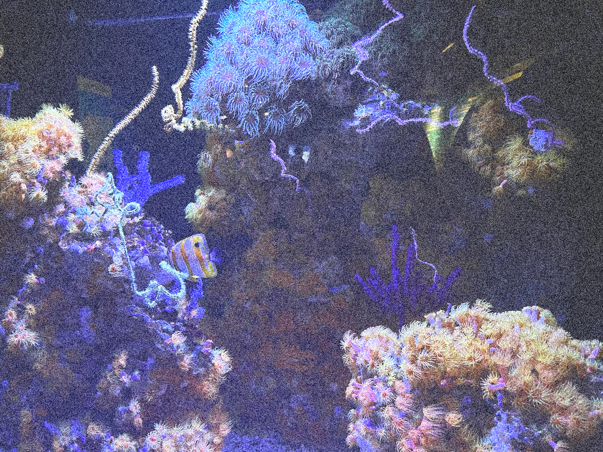

# Java-BufferedImage-Effects
A simple implementation of graphical effects that work with Java BufferedImages such as grayscale conversion, color inversion, Floyd–Steinberg dithering, noise, etc...

** All effects are calculated using the CPU

# Effects

## Base Image:

## Floyd–Steinberg dithering:

The example above is created with a dithering mod value of 2

## Grayscale:

The example above is created with the rec601 grayscale conversion algorithm

## Color Inversion:

## Noise:

The example above is created with a noise intensity value of 0.5
